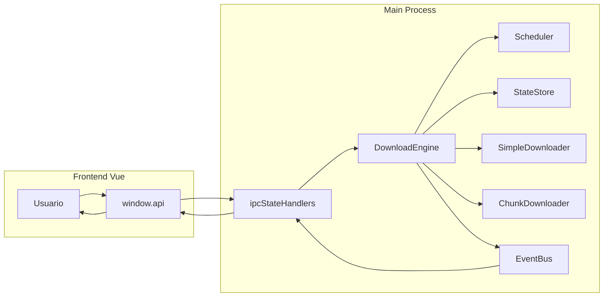

# Dpana Hub – ROM Download Manager

<div align="center">


<br />


**Aplicación de escritorio** para explorar y descargar archivos desde [Myrient](https://myrient.erista.me/), pensado para preservar video juegos y cachurear.

</div>

---

## Índice

- [Descripción del proyecto](#descripción-del-proyecto)
- [Características principales](#características-principales)
- [Gestión de descargas](#gestión-de-descargas-simples-y-por-chunks)
- [Estados de descarga](#estados-de-descarga)
- [Interfaz y experiencia de usuario](#interfaz-y-experiencia-de-usuario)
- [Tecnologías utilizadas](#tecnologías-utilizadas)
- [Funcionamiento del motor de descargas](#funcionamiento-general-del-motor-de-descargas)
- [Requisitos del sistema](#requisitos-del-sistema)
- [Instalación](#instalación)
- [Uso básico](#uso-básico-de-la-aplicación)
- [Romset Builder](#romset-builder)
- [Configuración](#configuración)
- [Estado del proyecto](#estado-del-proyecto)
- [Roadmap](#roadmap-o-mejoras-futuras)
- [Estructura del proyecto](#estructura-del-proyecto)
- [Scripts disponibles](#scripts-disponibles)
- [CI / Calidad](#ci--calidad)
- [Contribuciones](#contribuciones)
- [Advertencias y notas](#advertencias-y-notas-importantes)
- [Limitaciones conocidas](#limitaciones-conocidas)
- [Manejo de errores](#manejo-de-errores)
- [Seguridad (resumen)](#seguridad-resumen)
- [Licencia](#licencia)
- [Créditos](#créditos)

---

## Descripción del proyecto

**Dpana Hub – ROM Download Manager** (dpanahub-rdm) es un **gestor de descargas** que permite explorar los catálogos de **Myrient**, **LoLROMs**, **PleasureDome** y **My Abandonware** y descargar archivos de forma fiable y eficiente. Myrient es un recurso de preservación con más de **2,9 millones de entradas**; esta aplicación ofrece:

- **Exploración local**: acceso rápido a los catálogos mediante bases de datos SQLite locales, sin depender de la web oficial para navegar.
- **Multi-catálogo**: pantalla de inicio para elegir fuente (Myrient, LoLROMs, PleasureDome o My Abandonware); cada catálogo se gestiona con el mismo flujo (compresión .7z, descompresión al arranque, índices y búsqueda).
- **Descargas robustas**: cola persistente, descargas simples y descargas fragmentadas por chunks para archivos grandes, con reintentos, verificación de integridad y control de concurrencia.
- **Proyecto abierto**: código estructurado y extensible, adecuado para revisión y contribuciones.

Está orientado a usuarios que quieren descargar ROMs y datos de preservación desde Myrient, LoLROMs, PleasureDome o My Abandonware con una interfaz clara y un motor de descargas preparado para redes inestables y archivos grandes.

---

## Características principales

### Motor de descargas

- **Descargas simples**: archivos por debajo de un umbral (p. ej. 50 MB) se descargan en una sola conexión.
- **Descargas fragmentadas (chunked)**: archivos más grandes se dividen en partes que se descargan en paralelo para aprovechar mejor el ancho de banda (bandas dinámicas: 50–500 MB → 4–8 chunks; > 500 MB → 8–16 chunks).
- **Persistencia de cola**: el estado de la cola se guarda en SQLite; al reiniciar la aplicación, las descargas pueden continuar donde quedaron.
- **Resiliencia**: reintentos automáticos con back-off exponencial ante errores de red; circuit breaker para evitar saturar hosts con fallos repetidos.
- **Integridad**: fusión atómica de chunks y verificación por hash cuando está disponible.
- **Validación previa**: comprobación de espacio en disco y rutas antes de iniciar.
- **Test de calibración**: herramienta en configuración para ajustar chunks y paralelismo según la conexión.

### Exploración y búsqueda

- **Bases de datos locales**: SQLite con catálogos **Myrient** (más de 2,6 M de archivos), **LoLROMs**, **PleasureDome** y **My Abandonware**; pantalla de inicio para seleccionar la fuente a explorar.
- **Filtros**: por nombre, tamaño, fecha, extensión, etc.
- **Navegación**: explorador de carpetas tipo gestor de archivos.
- **Favoritos**: sistemas o carpetas guardadas por fuente (Myrient, LoLROMs, PleasureDome o My Abandonware).
- **Romset Builder**: asistente paso a paso para elegir una fuente, navegar por proyectos/compañías y carpetas hasta una carpeta con archivos, ver resumen (cantidad de archivos y tamaño estimado) y agregar todo el romset a la cola de descargas de una vez.
- **Enlaces magnet**: modal dedicado para ver, copiar o abrir en cliente externo cuando una descarga ofrece enlace magnet.

### Interfaz y UX

- **Diseño moderno**: tema claro/oscuro, tipografía Inter. Dos modos visuales seleccionables en Configuración:
  - **Glassmorphism** (por defecto): estilos tipo vidrio y transparencias.
  - **Frutiger Aero / Web 2.0 Gloss**: estilo inspirado en Windows Vista/7 (glossy, colorido, reflejos superiores, blur real y profundidad 3D suave); disponible en variante clara y oscura.
- **Micro-animaciones**: hover, transiciones y feedback visual.
- **Progreso detallado**: velocidad (EMA), ETA, porcentaje global y por archivo; indicador de progreso por chunks en descargas fragmentadas.
- **Control de cola**: pausar, reanudar, reiniciar o eliminar descargas.
- **Selección múltiple**: añadir muchos archivos a la cola de una vez (hasta un límite configurable).
- **Modo preparación de cola**: al superar un umbral de archivos agregados, se puede revisar el lote y confirmar antes de iniciar las descargas.
- **Romset Builder**: wizard accesible desde el menú lateral que guía la selección de catálogo (Myrient, LoLROMs, PleasureDome o My Abandonware), proyecto o compañía, carpetas anidadas y muestra un resumen (archivos y tamaño) antes de agregar la carpeta completa a la cola.

---

## 📂 Gestión de descargas (simples y por chunks)

- **Descarga simple**: un solo archivo, una conexión HTTP. Aplicada por defecto a archivos pequeños (p. ej. &lt; 50 MB) para no sobrecargar el servidor en la mayoría del catálogo.
- **Descarga por chunks**: para archivos más grandes, el motor divide el rango en fragmentos (HTTP Range), descarga varios chunks en paralelo, los escribe en disco, los fusiona en un único archivo y opcionalmente verifica el hash. El umbral y el número de chunks dependen de la configuración (p. ej. 50 MB de umbral; bandas 50–500 MB y &gt; 500 MB con distinto número y tamaño de chunk).
- **Cola**: las descargas se encolan con prioridad; un planificador (Scheduler) asigna slots según límites de descargas simultáneas y chunks simultáneos por archivo. El estado se persiste en SQLite (StateStore).

---

## Estados de descarga

Cada descarga recorre un ciclo de estados (guardados en SQLite):

| Estado        | Descripción breve                                     |
| ------------- | ----------------------------------------------------- |
| `queued`      | En cola, esperando slot.                              |
| `starting`    | Asignada a un slot; preparando conexión o chunks.     |
| `downloading` | Descargando (simple o por chunks).                    |
| `paused`      | Pausada por el usuario.                               |
| `merging`     | (Solo chunked) Fusionando chunks en el archivo final. |
| `verifying`   | Comprobando integridad (hash/tamaño).                 |
| `completed`   | Finalizada correctamente.                             |
| `failed`      | Error (red, servidor, disco, etc.).                   |
| `cancelled`   | Cancelada por el usuario.                             |

Los **chunks** de una descarga fragmentada tienen sus propios estados: `pending`, `downloading`, `completed`, `failed`, `paused`. El frontend muestra el estado actual de cada descarga y, en su caso, el progreso por chunk.

---

## Interfaz y experiencia de usuario

- **Ventana principal**: barra de título, barra de búsqueda, panel lateral (navegación/favoritos), área de archivos/carpetas y panel de cola de descargas.
- **Tema**: claro u oscuro; **modo visual** elegible en Configuración → Personalización: **Glassmorphism** (por defecto) o **Frutiger Aero** (Web 2.0 Gloss), con estilos tipo vidrio/glossy y componentes Vue (tablas, modales, toasts).
- **Acciones rápidas**: descargar archivo, descargar selección, descargar carpeta completa (con confirmación y límite de archivos por carpeta).
- **Cola de descargas**: lista de ítems con progreso, velocidad, ETA y acciones (pausar, reanudar, reiniciar, eliminar); filtro por estado y búsqueda por nombre/ruta/URL.
- **Panel de estadísticas**: modal (accesible desde el menú lateral) con métricas de sesión (velocidad actual, descargas iniciadas/completadas/fallidas, bytes descargados, latencia, métricas por host, estado del circuit breaker).
- **Configuración**: carpeta de descargas, descargas simultáneas, chunks por archivo, umbral de confirmación en lotes, notificaciones, reanudar al iniciar, **tema visual** (Glassmorphism / Frutiger Aero), test de calibración.
- **Consola de logs**: accesible desde la interfaz para diagnóstico.
- **Apertura de carpeta de datos**: acceso rápido a config, logs y base de datos de la aplicación.

---

## Tecnologías utilizadas

| Capa          | Tecnología                                                                                    |
| ------------- | --------------------------------------------------------------------------------------------- |
| Runtime       | Electron 40                                                                                   |
| Lenguaje      | TypeScript (electron, workers, scripts); Vue 3 con `<script setup lang="ts">`                 |
| Frontend      | Vue 3 (Composition API), Vite 7                                                               |
| Base de datos | [Better-SQLite3](https://github.com/WiseLibs/better-sqlite3) (catálogo y estado de descargas) |
| Validación    | Zod                                                                                           |
| Logging       | [electron-log](https://github.com/megahertz/electron-log)                                     |
| Estilos       | CSS con variables con temas de glassmorphism y modo aereo como windows 7                      |
| Iconos        | Lucide Vue Next                                                                               |

---

## Funcionamiento general del motor de descargas

1. **Entrada**: el usuario pide una descarga (archivo, selección o carpeta). El frontend llama a la API expuesta por Electron (`window.api`), que valida y delega en el backend.
2. **Persistencia**: el backend (DownloadEngine, StateStore) registra la descarga en SQLite con estado `queued` y metadatos (URL, ruta, tamaño si está disponible, etc.).
3. **Planificación**: el Scheduler respeta límites de descargas simultáneas y chunks por archivo; asigna slots y prioridad (con aging para evitar inanición).
4. **Ejecución**:
   - **Archivos “pequeños”** (p. ej. &lt; 50 MB): SimpleDownloader hace una petición HTTP y escribe a disco; progreso y estado se actualizan y se emiten al frontend vía EventBus.
   - **Archivos “grandes”**: ChunkManager calcula los rangos, ChunkDownloader descarga chunks en paralelo, FileAssembler fusiona en un único archivo; Verifier comprueba hash/tamaño si aplica.
5. **Eventos**: EventBus notifica cambios de estado y progreso; el frontend actualiza la cola y los indicadores en tiempo real.
6. **Cierre**: al cerrar la aplicación, el motor pausa descargas activas, persiste el estado en SQLite y permite un cierre ordenado para poder reanudar después.

Componentes clave del motor: **DownloadEngine**, **StateStore**, **Scheduler**, **ChunkManager**, **ChunkDownloader**, **SimpleDownloader**, **FileAssembler**, **Verifier**, **EventBus**, **CircuitBreakerManager**, **SessionManager**, **DownloadValidator**, **SpeedTracker**, **ChunkStore**, **DownloadMetrics** (métricas de sesión), **ChunkProgressAggregator**, **AdaptiveChunkSizer**, **AdaptiveConcurrencyController**.

Flujo de datos (usuario → backend → UI):



Los estados de una descarga se persisten en **StateStore** (SQLite): `queued` → `starting` → `downloading` → (opcional) `merging` → `verifying` → `completed`, o `failed` / `cancelled` / `paused`.

---

## Requisitos del sistema

- **Node.js**: 20.x o superior (solo para desarrollo).
- **npm**: 10.x o superior.
- **7-Zip**: necesario para la extracción inicial de la base de datos si se distribuye en formato `.7z`.
- **Sistema operativo**: Windows 10/11 (portable x64), macOS (dmg/zip) o Linux (AppImage, .deb).
- **Bases de datos de catálogo**: al menos `myrient_data.db` (o `myrient_data.7z`); opcionalmente `lolrom_data.db`, `pleasuredome_data.db` y `myabandonware_data.db` (o sus `.7z`) para explorar LoLROMs, PleasureDome y My Abandonware. Ubicación: `resources/` en desarrollo o `extraResources` en el build.
- **Resolución de pantalla**: la ventana admite un tamaño mínimo de **320×240** píxeles (útil en monitores CRT o ventanas muy pequeñas). La interfaz es responsive y se adapta a distintos anchos, proporciones (4:3, 16:9, 21:9, 9:16) y escalado del sistema operativo (DPI).

---

## 🛠️ Instalación

### Desarrollo

```bash
git clone https://github.com/crtgamers/dpanahub-rdm.git
cd dpanahub-rdm

npm install

# Copiar o colocar las bases de datos en resources/
# myrient_data.db (requerido) y opcionalmente lolrom_data.db, pleasuredome_data.db, myabandonware_data.db
# Si se usan archivos .7z, 7-Zip debe estar instalado

npm run dev
```

### Usuario final (Windows)

Tras `npm run build` o `npm run build:win`, el ejecutable portable (x64) se genera en `dist-electron/`.

Opcional: script **`deploy.ps1`** para descargar e instalar la aplicación de forma remota (ejemplo: `irm https://... | iex`). También existe **`Install.ps1`** para instalación local; puede requerir configurar la ruta o ID del paquete según el caso.

### Usuario final (macOS)

Tras `npm run build` o `npm run build:mac`, se generan `dmg` y `zip` en `dist-electron/`. Los builds por defecto no están firmados ni notarizados; ver workflows en `.github/workflows/build-macos.yml` para CI.

### Usuario final (Linux)

Tras `npm run build:linux`, se generan **AppImage** y paquete **.deb** en `dist-electron/`. Para AppImage puede ser necesario `libfuse2` (en Ubuntu/Debian: `sudo apt-get install libfuse2`).

---

## Uso básico de la aplicación

1. **Explorar**: navega por carpetas en el panel o usa la búsqueda para encontrar archivos.
2. **Descargar un archivo**: usa el botón de descarga del archivo.
3. **Descargar varios**: selecciona archivos y usa “Descargar selección” (respetando el límite de selección, p. ej. 1000 archivos).
4. **Descargar carpeta**: usa “Carpeta completa”; se aplica confirmación y límite de archivos por carpeta (p. ej. 1000, configurable).
5. **Gestionar la cola**: en “Cola de descargas” puedes pausar, reanudar, reiniciar o eliminar ítems.
6. **Romset Builder**: en el menú lateral, “Romset Builder” abre un asistente para elegir fuente (Myrient, LoLROMs, PleasureDome o My Abandonware), navegar por proyectos/compañías y carpetas hasta la que quieras descargar, ver el resumen (número de archivos y tamaño) y agregar toda la carpeta a la cola con un clic.
7. **Enlaces magnet**: si una descarga ofrece enlace magnet, puedes abrirlo desde la cola para copiarlo o abrirlo con tu cliente de torrents.

**Opciones avanzadas**: filtros en el panel de archivos, modo preparación de cola (revisar lote antes de iniciar), Romset Builder (menú lateral) para encolar carpetas completas por wizard, test de calibración en Configuración, consola de logs y abrir carpeta de datos desde la app.

---

## Romset Builder

El **Romset Builder** es un asistente (wizard) integrado que permite elegir una carpeta completa del catálogo —por ejemplo un proyecto o un sistema— y agregar todos sus archivos a la cola de descargas en un solo paso, con un resumen previo de cantidad de archivos y tamaño estimado.

### Cómo abrirlo

- En el **menú lateral** (sidebar), haz clic en **«Romset Builder»** (icono de capas). Se abre un panel modal sobre la aplicación.

### Flujo de pasos

El asistente tiene tres fases, con un indicador de pasos (stepper) y breadcrumb en la parte superior:

1. **Fuente de datos**  
   Elige el catálogo: **Myrient**, **LoLROMs**, **PleasureDome** o **My Abandonware**. La aplicación cargará la base de datos correspondiente si aún no está activa.

2. **Navegación**  
   - **En Myrient:** el primer nivel muestra solo **proyectos oficiales** (No-Intro, Redump, TOSEC, MAME, HBMAME, FinalBurn Neo, Total DOS Collection, eXo, etc.). Selecciona un proyecto y luego navega por las carpetas (sistema, variantes, etc.) hasta la carpeta que quieras descargar.  
   - **En LoLROMs, PleasureDome o My Abandonware:** el primer nivel muestra las **compañías o fabricantes** (o estructura equivalente) desde la raíz. Elige una y luego navega por carpetas hasta la que contenga los archivos.  
   - En cada nivel puedes **filtrar** la lista si hay muchas opciones (aparece un campo de búsqueda cuando hay más de 8 ítems).  
   - El wizard **detecta automáticamente** cuándo la carpeta seleccionada contiene archivos: en ese momento pasa al resumen sin pedir más niveles.

3. **Resumen**  
   Se muestra la **ruta elegida** (fuente y carpetas), el **número total de archivos** y el **tamaño estimado** (calculado de forma recursiva en la base de datos, sin transferir la lista completa).  
   Si todo es correcto, pulsa **«Agregar a la cola»**. Los archivos de esa carpeta se encolan como una descarga de carpeta completa; se aplican las mismas reglas que en «Carpeta completa» (confirmación y límites si los tienes configurados).

### Botones y navegación

- **Anterior**: vuelve al paso o nivel anterior (por ejemplo, a elegir otra subcarpeta o a cambiar de fuente).  
- **Siguiente**: confirma la carpeta seleccionada en el nivel actual y carga el siguiente nivel, o pasa al resumen si esa carpeta ya tiene archivos.  
- **Cancelar / Cerrar**: cierra el asistente sin agregar nada a la cola.  
- **Agregar a la cola** (solo en resumen): encola todos los archivos de la carpeta elegida y cierra el modal.

### Requisitos y notas

- Debe estar configurada una **carpeta de descargas** en Configuración; si no, al agregar a la cola puede mostrarse un aviso.  
- El resumen (archivos y tamaño) se calcula en el backend con la base de datos del catálogo activo; no se descargan listados desde internet.  
- Si cambias de fuente (Myrient, LoLROMs, PleasureDome o My Abandonware) en el primer paso, la app carga la base correspondiente automáticamente.  
- El Romset Builder está disponible en los **tres idiomas** de la aplicación (español, español Chile, inglés).

---

## Configuración

### Variables de entorno

| Variable              | Descripción                              |
| --------------------- | ---------------------------------------- |
| `VITE_DEV_SERVER_URL` | URL del servidor Vite (solo desarrollo). |
| `NODE_ENV`            | `development` o `production`.            |

### Ubicación de datos

La aplicación guarda configuración y estado en el directorio de datos del usuario:

- **Windows**: `%APPDATA%\dpanahub-rdm\` (o la ruta devuelta por `app.getPath('userData')`).
- **macOS**: `~/Library/Application Support/dpanahub-rdm/`.
- **Linux**: `~/.config/dpanahub-rdm/`.

En ese directorio suelen estar: `config/*.json`, `downloads-state.db` (cola y estado de descargas), `window-state.json`, `logs/*.log`.

### Parámetros en la UI (Configuración)

- **Carpeta de descargas**: ruta base donde se guardan los archivos.
- **Descargas simultáneas**: 1–3 (por defecto 3).
- **Chunks simultáneos por archivo**: 1–5 (por defecto 3).
- **Umbral de confirmación en lotes**: cuántos archivos agregar antes de mostrar confirmación.
- **Notificaciones**: activar/desactivar toasts.
- **Reanudar al iniciar**: restaurar descargas pausadas al abrir la aplicación.

### Actualizaciones automáticas

La aplicación incluye **actualizaciones automáticas** con `electron-updater` cuando se ejecuta la versión empaquetada:

- Al iniciar se comprueba si hay una nueva versión en segundo plano.
- En **Configuración → Actualizaciones** puedes ver la versión actual, pulsar **Buscar actualizaciones** y, si hay una descarga lista, **Reiniciar e instalar**.

**Windows (dos modos):**

- **Portable** (un solo `.exe`): el updater descarga el nuevo `.exe` y lo ejecuta al reiniciar.
- **Carpeta** (ejecutar desde `dpanahub-rdm-win`): el updater descarga el ZIP del release, lo extrae y reemplaza los archivos de la carpeta in-place antes de reiniciar.

Para **publicar** releases y que los usuarios reciban actualizaciones:

1. El `build.publish` en `package.json` ya está configurado para el repo (p. ej. `crtgamers/dpanahub-rdm`).
2. Crea releases en GitHub con etiquetas versionadas (p. ej. `v1.3.1`).
3. **Windows**: sube a la release los archivos que genera `npm run build` o `npm run build:win` en `dist-electron/`:
   - **latest.yml** (obligatorio para que funcione “Buscar actualizaciones” en el portable): se genera automáticamente tras el build. Sin este archivo en el release, el updater devuelve error 404 al buscar actualizaciones.
   - **.exe portable**: para que el updater lo encuentre, el nombre del asset en el release debe usar guiones: `Dpana-Hub-–-ROM-Download-Manager-<version>.exe` (p. ej. `Dpana-Hub-–-ROM-Download-Manager-1.3.1.exe`). El script `generate-latest-yml.ts` ya referencia ese nombre.
   - **.zip** (modo carpeta): `Dpana Hub – ROM Download Manager <version>-win.zip` (p. ej. `Dpana Hub – ROM Download Manager 1.3.1-win.zip`).
4. Opcional: usa CI con `GH_TOKEN` y `electron-builder --publish always` para publicar automáticamente (incluye `latest.yml`).

---

## Estado del proyecto

El proyecto se encuentra en **desarrollo activo**, en estado **beta**: las funcionalidades principales (exploración, cola, descargas simples y por chunks, persistencia, verificación) están implementadas y en uso. La **v1.9.0** incorpora los catálogos **PleasureDome** y **My Abandonware** (cuatro fuentes en total: Myrient, LoLROMs, PleasureDome, My Abandonware), el **modal de enlaces magnet** para copiar o abrir en cliente externo, y mejoras en la configuración y descarga de bases de datos por fuente. La v1.8.0 añade el indicador de estado de la base de datos en el sidebar y el flujo de verificación y descarga de bases cuando no están presentes; la v1.7.0 el modo visual Frutiger Aero; la v1.6.0 el Romset Builder; la v1.5.0 el soporte multi-catálogo y pantalla de inicio. Ver [CHANGELOG.md](CHANGELOG.md) para el detalle. Pueden existir limitaciones (véase [Limitaciones conocidas](#limitaciones-conocidas)) y el roadmap incluye mejoras de compatibilidad, UX y documentación (véase [Roadmap](#roadmap-o-mejoras-futuras)).

---

## Roadmap o mejoras futuras

Previstas (detalle en `TODO.md`):

1. **Wizard de configuración inicial** (First Run Wizard): tema, carpeta de descargas, chunks, confirmaciones.
2. **Sistema de tutorial interactivo**: pasos guiados por menú, búsqueda, cola y descargas.
3. **Filtros avanzados**: etiquetas de región (JPN, USA, EUR), normalización (JP=JPN, US=USA, etc.).
4. **Glosario de términos**: Aftermarket, Rev, Split, región, etc., accesible desde menú y ayuda contextual.
5. **Sección informativa de emuladores**: enlaces, descripciones y sistemas compatibles; sin ejecución de ROMs en una primera fase.
6. **Múltiples idiomas (i18n)**: ya implementado en 1.3.0. Español como idioma principal (por defecto), inglés y español de Chile (es-CL). Validaciones en CI, tipado fuerte de keys, CONTRIBUTING para añadir idiomas. Ver [CONTRIBUTING.md](CONTRIBUTING.md#internacionalización-i18n).

---

## Estructura del proyecto

```
dpanahub-rdm/
├── electron/                 # Proceso principal de Electron (TypeScript)
│   ├── engines/              # Motor de descargas
│   │   ├── DownloadEngine.ts # Orquestador principal
│   │   ├── StateStore.ts     # Persistencia transaccional (SQLite WAL, downloads-state.db)
│   │   ├── Scheduler.ts      # Planificación y límites de cola
│   │   ├── ChunkStore.ts     # Almacén de chunks en disco
│   │   ├── ChunkManager.ts   # Coordinación de descargas fragmentadas
│   │   ├── ChunkDownloader.ts# Descarga de chunks HTTP Range
│   │   ├── SimpleDownloader.ts # Descarga directa (archivos pequeños)
│   │   ├── FileAssembler.ts  # Fusión atómica de chunks
│   │   ├── Verifier.ts       # Verificación de integridad por hash
│   │   ├── EventBus.ts       # Eventos hacia el frontend
│   │   ├── DownloadMetrics.ts# Métricas de sesión (velocidad, latencia, por host)
│   │   ├── CircuitBreakerManager.ts
│   │   ├── SessionManager.ts
│   │   ├── DownloadManager.ts
│   │   ├── DownloadValidator.ts
│   │   └── SpeedTracker.ts
│   ├── services/             # Lógica de negocio
│   │   ├── BaseService.ts
│   │   ├── DownloadService.ts
│   │   ├── FileService.ts
│   │   ├── QueueService.ts
│   │   └── SearchService.ts
│   ├── workers/              # worker_threads (descarga, merge, consultas DB)
│   ├── constants/
│   ├── utils/
│   ├── migration/
│   ├── ipcHandlers.ts
│   ├── ipcStateHandlers.ts
│   ├── updater.ts            # Actualizaciones automáticas (electron-updater)
│   ├── main.ts
│   ├── preload.ts
│   ├── window.ts
│   ├── database.ts
│   └── config.ts
├── src/                      # Frontend Vue 3 + Vite (TypeScript)
│   ├── App.vue
│   ├── main.ts
│   ├── style.css
│   ├── components/
│   ├── composables/          # useDownloads, useQueueFilter, useFileSelection, etc.
│   ├── constants/
│   ├── locales/              # i18n (en, es, es-CL)
│   ├── plugins/
│   ├── services/
│   └── utils/
├── scripts/                  # Scripts de build (TypeScript, ejecutados con tsx)
│   ├── build-db-7z.ts
│   ├── build-icon.ts
│   ├── check-cjs-usage.ts
│   ├── inspect-asar.ts       # Inspección de app.asar (tamaño por carpeta)
│   ├── prune-app-deps.cjs    # Hook beforePack: reduce tamaño del asar
│   └── rename-win-output.ts
├── resources/                # Base de datos SQLite (no versionada: .db, .7z, etc.)
├── __tests__/
├── .github/workflows/
├── vite.config.ts
├── deploy.ps1                # Script de instalación remota (PowerShell)
├── Install.ps1               # Script de instalación local (Windows)
└── package.json
```

El frontend se comunica con Electron mediante `window.api` (preload + contextBridge). El backend está en TypeScript; los workers se compilan con `npm run build:electron-workers` (tsconfig.workers.json). Se usa SQLite para catálogo y cola.

**Documentación del código:** los módulos principales (electron, src, shared) están documentados con **JSDoc**: descripción de módulo, `@param` y `@returns` en funciones y métodos públicos. Facilita el mantenimiento y la incorporación de contribuidores.

---

## Scripts disponibles

| Script                     | Descripción                                                                   |
| -------------------------- | ----------------------------------------------------------------------------- |
| `npm run dev`              | Modo desarrollo con Hot Reload (Vite + Electron).                             |
| `npm run build`            | Compila frontend, workers y genera ejecutable (Windows portable por defecto; incluye compresión de myrient_data.db y lolrom_data.db a .7z). |
| `npm run build:win`        | Build solo para Windows (portable x64).                                       |
| `npm run build:mac`        | Build solo para macOS (dmg + zip, sin firma).                                 |
| `npm run build:linux`      | Build solo para Linux (AppImage + .deb).                                      |
| `npm run build:electron-workers` | Compila los workers de Electron (TypeScript → dist-electron/workers).   |
| `npm run build-icon`       | Genera iconos para la aplicación.                                             |
| `npm run inspect-asar`     | Tras un build, inspecciona el contenido de `app.asar` y muestra tamaños por carpeta (útil si el asar pesa mucho). |
| `npm run lint`             | Ejecuta ESLint.                                                               |
| `npm run lint:fix`         | ESLint con corrección automática.                                             |
| `npm run format`           | Formatea con Prettier.                                                        |
| `npm run format:check`     | Comprueba formato sin modificar.                                              |
| `npm run test`             | Suite completa de tests (Jest con ES modules).                                |
| `npm run test:unit`        | Solo tests unitarios.                                                         |
| `npm run test:integration` | Solo tests de integración.                                                    |
| `npm run test:acceptance`  | Tests de aceptación.                                                          |
| `npm run test:watch`       | Tests en modo watch.                                                          |
| `npm run test:coverage`    | Tests con cobertura.                                                          |
| `npm run check-cjs`        | Verifica uso de CommonJS.                                                     |
| `npm run depcheck`         | Comprueba dependencias no usadas o no declaradas (ejecutar de vez en cuando).  |
| `npm run typecheck`        | Verificación de tipos con TypeScript (sin emitir).                             |
| `npm run typecheck:vue`    | Verificación de tipos en componentes Vue (vue-tsc).                           |
| `npm run typecheck:all`    | typecheck + typecheck:vue (usado en CI).                                      |
| `npm run validate-locales` | Comprueba que todos los idiomas tengan las mismas keys que `en/common.json`.   |
| `npm run validate-i18n-keys` | Comprueba que las keys usadas en `t()` existan en `en`.                     |
| `npm run validate-i18n-keys:orphans` | Lista keys definidas pero no usadas como literal en código.           |

---

## CI / Calidad

**Tamaño del instalador (app.asar):** un `app.asar` de más de ~100 MB suele indicar que se está empaquetando algo innecesario (p. ej. `node_modules` completos o binarios de todas las plataformas). El build incluye un hook `beforePack` (`scripts/prune-app-deps.cjs`) que elimina de `node_modules` lo que no se necesita en runtime (p. ej. código fuente de better-sqlite3, binarios 7z de otras plataformas). Si aun así el asar es grande, ejecuta `npm run inspect-asar` tras un build para ver qué carpetas ocupan más espacio.

**Revisión de dependencias:** puedes ejecutar `npm run depcheck` periódicamente para detectar paquetes declarados en `package.json` que no se usan en el código, o dependencias en uso no declaradas. Revisa los resultados (p. ej. herramientas usadas solo en scripts de build pueden aparecer como "no usadas") antes de eliminar algo. **Nota:** `@types/jest` puede aparecer como "unused" en depcheck; es un falso positivo: Jest se usa en la suite de tests y los tipos se consumen indirectamente. No elimines `@types/jest` de `devDependencies`.

**Estructura de tests:** la suite está en `__tests__/`: **unit** (módulos aislados con mocks), **integration** (flujos que combinan varios módulos o IPC) y **acceptance** (criterios de aceptación). Los mocks de Electron, config y base de datos están en `__tests__/__mocks__/`. Para ejecutar solo una carpeta: `npm run test -- --testPathPattern=__tests__/unit` (o `__tests__/integration`). Cobertura de código: `npm run test:coverage` (genera informe en `coverage/`). Ver [CONTRIBUTING.md](CONTRIBUTING.md#tests) para convenciones y cómo mockear Electron/DB al añadir tests.

El flujo de GitHub Actions (`.github/workflows/ci.yml`) se ejecuta en cada push y PR a `main`/`master`:

- **Lint y tests**: checkout, Node 20, `npm ci`, `npm run validate-locales`, `npm run validate-i18n-keys`, `npm run typecheck:all`, `npm run lint`, `npm run format:check`, `npm run test:unit`, `npm run test:integration`. No incluye compilación de artefactos instalables. Opcional en local: `npm run test:coverage` para ver cobertura.

Workflows separados (build por plataforma):

- **`build-windows.yml`**: genera ejecutable portable Windows (x64) en `windows-latest`.
- **`build-linux.yml`**: genera AppImage y .deb para Linux en `ubuntu-latest` (requiere `libfuse2` para AppImage).
- **`build-macos.yml`**: genera builds de macOS (dmg, zip, .app) sin firma en `macos-latest`.
---

## Internacionalización (i18n)

La aplicación soporta varios idiomas. El idioma se determina en este orden:

1. **Idioma guardado** por el usuario (Configuración → Personalización → Idioma).
2. **Idioma del sistema** (Windows, macOS o Linux vía Electron).
3. **Por defecto**: Español (`es`).

### Idiomas incluidos

- **Español** (`es`) – referencia base.
- **Español (Chile)** (`es-CL`) – fallback a `es` si falta una clave.
- **English** (`en`).

### Cómo contribuir con traducciones

1. **Añadir un idioma nuevo**
   - Copia la carpeta `src/locales/en/` y renómbrala al código de idioma (ej: `fr` para francés).
   - Traduce **solo los valores** del archivo `common.json`; **no cambies las claves** (son semánticas, ej: `errors.connectionError`).

   - Registra el idioma en `src/locales/index.ts`: añade el código a `SUPPORTED_LOCALES` y a `LOCALE_LABELS`.

2. **Actualizar un idioma existente**
   - Edita `src/locales/<código>/common.json` y traduce las claves nuevas o ajusta textos. No elimines claves.

3. **Validar**
   - Ejecuta `npm run validate-locales`. El script comprueba que no falten claves ni haya claves inválidas respecto a `en/common.json`.

Estructura de archivos:

```
src/locales/
├── en/
│   └── common.json   ← Referencia
├── es/
│   └── common.json
├── es-CL/
│   └── common.json
└── index.ts          ← SUPPORTED_LOCALES y LOCALE_LABELS
```

---

## 🤝 Contribuciones

Las contribuciones son bienvenidas. Se recomienda:

- **Leer [CONTRIBUTING.md](CONTRIBUTING.md)** para detalles sobre cómo contribuir y, en particular, cómo **añadir o modificar idiomas (i18n)**.
- Abrir un issue para discutir cambios grandes o nuevas funcionalidades.
- Seguir el estilo de código del proyecto (ESLint, Prettier).
- Si tocas traducciones o textos de la UI: ejecutar `npm run validate-locales` y `npm run validate-i18n-keys` antes del PR (el CI también los ejecuta).
- Añadir o ajustar tests cuando sea apropiado.
- Respetar la licencia GPL v3 del proyecto (obra derivada bajo la misma licencia).

---

## ⚠️ Advertencias y notas importantes

- **Bases de datos de catálogo**: la aplicación requiere al menos la base de datos Myrient (`myrient_data.db` o `myrient_data.7z`) en `resources/`; opcionalmente LoLROMs, PleasureDome y My Abandonware (sus respectivos `.db` o `.7z`). Son archivos grandes; su obtención y actualización se entregan entre versiones; la descarga desde la aplicación está disponible cuando faltan (v1.8.0); la auto-actualización está prevista como mejora futura.
- **Uso responsable**: Myrient es un recurso de preservación; usa la aplicación de forma responsable y conforme a las condiciones de uso del servicio.
- **Rutas y permisos**: asegúrate de tener espacio suficiente y permisos de escritura en la carpeta de descargas y en el directorio de datos de la aplicación.

---

## Limitaciones conocidas y autoimpuestas

1. **Bases de datos**: requiere al menos `myrient_data.db` en `resources/`; opcionalmente `lolrom_data.db`, `pleasuredome_data.db` y `myabandonware_data.db` para LoLROMs, PleasureDome y My Abandonware. Son archivos pesados y está en evaluación su optimización.
2. **Selección masiva**: máximo de 1000 archivos por selección; para más, usar descarga de carpeta completa.
3. **Carpeta completa**: la descarga de carpeta completa permite configurar un número máximo de archivos por carpeta.
4. **Descargas por chunks**: en algunos casos las descargas fragmentadas pueden fallar de forma intermitente; el motor reintenta el chunk desde cero para garantizar integridad, lo que puede provocar pausas breves en la progresión. La opción de chunks se puede activar manualmente en configuración.
5. **Cola no inicia en casos puntuales**: en situaciones poco frecuentes (p. ej. tras reemplazar ciertos archivos o encolar muchos ítems), la cola puede no arrancar; reiniciar la aplicación suele resolverlo. Se trata de un bug conocido bajo investigación.

---

## Manejo de errores

- **Backend**: `uncaughtException` y `unhandledRejection` se registran en log y se puede notificar al frontend (`error-notification`). Los handlers IPC pasan por un wrapper que captura excepciones y devuelve `{ success: false, error: string }` cuando corresponde.
- **Frontend**: manejador global de errores y componentes de respaldo para fallos en subárboles; las llamadas a `window.api` comprueban `success` antes de usar `data`.
- **Red**: reintentos con back-off exponencial; circuit breaker para hosts problemáticos; notificaciones opcionales al usuario en fallos de chunk o descarga.

---

## Seguridad (resumen)

La aplicación aplica las siguientes medidas de seguridad en el proceso main (backend):

- **Validación de entradas**: términos de búsqueda (longitud, caracteres especiales), IDs de nodo y de descarga (enteros positivos), nombres de archivo de configuración (solo `.json`, sin path traversal). Toda entrada que llega por IPC se valida antes de usarse.
- **Rutas de descarga**: las rutas que envía el renderer se normalizan con `path.resolve` y se rechazan si contienen `..` (path traversal). Se bloquean la raíz del sistema y directorios críticos del SO (p. ej. Windows, Program Files); las rutas “sensibles” (p. ej. carpetas del sistema) se consideran válidas pero el frontend puede mostrar advertencia.
- **URLs**: solo se aceptan URLs con protocolo **HTTPS** y cuyo host esté en la lista permitida (`config.security.allowedHosts`). Las descargas solo se inician hacia esos dominios.
- **SQL**: las consultas al catálogo y al estado de descargas usan **prepared statements** (placeholders); no se concatena entrada de usuario en SQL. Los nombres de tabla (p. ej. FTS) se validan con una lista blanca de caracteres y se rechazan si contienen palabras clave peligrosas.
- **Nombres de archivo**: los títulos y nombres que forman parte de rutas de guardado se sanitizan (caracteres prohibidos, nombres reservados en Windows, longitud máxima) antes de escribir en disco.
- **Rate limiting**: los canales IPC sensibles (búsqueda, añadir descarga, obtener estado de cola, etc.) tienen límite de frecuencia para mitigar abuso.

Para más detalle, ver los módulos `electron/utils/validation.ts`, `electron/utils/downloadPath.ts` y los handlers en `electron/ipcHandlers.ts` y `electron/ipcStateHandlers.ts`.

---

## 📄 Licencia

Este proyecto está bajo la licencia **GNU General Public License v3.0 (GPL v3)**. Puedes usar, modificar y redistribuir el software bajo los términos de esta licencia; las obras derivadas deben distribuirse bajo la misma licencia. Ver [LICENSE](LICENSE) para el texto completo.

---

## Créditos

- **Autores**: Bastian Aguirre (CRT Gamers Chile), Pablo M. Iglesias.
- **Myrient** – Por su gran trabajo preservando y funcionando como hosting de datos.
- **Erista** – Infraestructura de acceso a los archivos.
- **LoLROMs** – Por su gran trabajo preservando y funcionando como hosting de datos.
- **PleasureDome** – Por su gran trabajo preservando y funcionando como hosting de datos.
- **My Abandonware** – Por su gran trabajo preservando y funcionando como hosting de datos.
- **Comunidad CRT Gamers Chile** – Por inspirarnos y darnos feedback.
- **Icono y fondo del modo aéreo** – La gran Monstwitos (https://www.instagram.com/monstuwitos/) diseñó el icono de la aplicación y el fondo del modo Aéreo.

---

<div align="center">

Desarrollado con todo mi corazon para la comunidad CRT Gamers Chile (el grupete de mi corazoncito) y para la comunidad de preservación de videojuegos en el mundo.
En nuestros corazones todavia esta el legado de CTMW.

</div>
